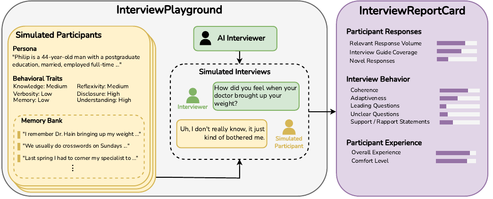

<div align="center">
  
</div>

<h1 align="center">InterviewPlayground: A Validated Simulation Environment for Evaluating AI Interviewers</h1>

<div align="center">

[](https://arxiv.org/abs/XXXX.XXXXX)
[](https://pypi.org/project/interviewplayground/)
[](https://pypi.org/project/interviewplayground/)
[](LICENSE)

</div>

InterviewPlayground is a simulation environment for evaluating AI interviewers using simulated study participants whose behaviors are grounded in social theory. Simulated studies in InterviewPlayground produce an InterviewReportCard, which assesses the performance of AI interviewers using a suite of validated measures. InterviewPlayground also includes three simulation settings based on real interview studies in public health, political science, and human-computer interaction. In our paper, we validate these settings by comparing them to 15 real qualitative studies with 450 human participants and demonstrating that the performance of an AI interviewer in InterviewPlayground predicts their performance in human studies.

```bibtex
@article{ivey2026interviewplayground,
  title     = {InterviewPlayground: A Validated Simulation Environment for Evaluating AI Interviewers},
  author    = {Ivey, Jonathan and Liang, Aimee and Wang, Arthur Y.S. and Mandell, Madeline and Xiao, Ziang and Field, Anjalie},
  journal   = {arXiv preprint arXiv:XXXX.XXXXX},
  year      = {2026}
}
```

---

## Quick Start

### Install

```bash
pip install interviewplayground
```

### Set a model

InterviewPlayground uses [LiteLLM](https://github.com/BerriAI/litellm). Set an API key:

```bash
export OPENAI_API_KEY="sk-..."
```

Anthropic, Gemini, and self-hosted vLLM models are also supported. See [Setup](#setup) for details.

### Load a preset

Load one of InterviewPlayground's validated simulation settings

```python
from interviewplayground import load_preset

study = load_preset("obesity_weight_management")
p = study.participants[0]
response = p.ask("How have weight conversations with your doctor gone?")
```

| Name | Topic | Participants |
|---|---|---|
| `obesity_weight_management` | Weight discussions in primary care and commercial program referrals | 30 |
| `asian_american_politics` | Asian American identity and political preferences | 30 |
| `genai_knowledge_work` | GenAI tools in knowledge work contexts | 30 |

Each participant has 200 memories — 194 background memories plus 6 insight memories drawn from the study's 15 key insights — so different participants will provide different information.
See [Creating Your Own Study](#creating-your-own-study) to build your own simulation setting.

```python
print(f"{len(study.research_questions)} research questions")

for topic in study.interview_guide:
    print(topic["topic"])
    for subtopic in topic["subtopics"]:
        print(f"  - {subtopic}")
```

Presets also include `research_questions` and an `interview_guide` that you can use to guide your AI interviewer.

### Run an interview with your own interviewer

Here is an example of how you could evaluate an AI interviewer using an InterviewPlayground simulated study. For each interview you let the interviewer generate a question for the participant, receive responses, and then generate the next question. To know when the interview ends, you keep track of the real time it takes the AI interviewer to generate a question and the estimated time it would take a participant to respond.

```python
from time import perf_counter
from interviewplayground.speaking_time import estimate_speaking_duration

def run_interview(participant, time_limit_minutes=30.0):
    transcript = []
    elapsed_seconds = 0.0

    while elapsed_seconds < time_limit_minutes * 60:
        t0 = perf_counter()
        question = my_interviewer.next_question(transcript)
        elapsed_seconds += perf_counter() - t0
        if question is None:  # interviewer signals it's done
            break

        answer = participant.ask(question)
        elapsed_seconds += estimate_speaking_duration(answer, participant.verbosity)

        transcript.append({"role": "interviewer", "content": question})
        transcript.append({"role": "participant", "content": answer})

    return transcript

# Interview all 30 participants in the preset
for participant in study.participants:
    run_interview(participant)
```

`participant.ask()` already appends each turn to `participant.transcript` in the package's own format, so `study.evaluate()` picks it up automatically — the `transcript` list above is just what you pass to your interviewer. Inform your interviewer using the preset's `study.research_questions` and `study.interview_guide`. See [Using the Interview Guide](#using-the-interview-guide) for an example.

### Evaluate interview quality

Once an interview is complete, you can use `study.evaluate()` to score each participant's `transcript` with the InterviewReportCard suite.

```python
results = study.evaluate()
```

| Dimension | Metrics |
|---|---|
| `participant_responses` | `relevant_response_volume`, `interview_guide_coverage`, `novel_responses` |
| `interviewer_behavior` | `coherence`, `adaptiveness`, `leading_questions`, `support_rapport`, `unclear_questions` |
| `participant_experience` | `comfort_level`, `overall_experience` |
| `conversation_length`| `avg_turns`, `avg_response_length` |

See [Evaluating Interview Quality](#evaluating-interview-quality) for per-participant breakdowns and batch evaluation.

---

## Setup

### Installing from source

```bash
git clone https://github.com/jonathanivey/interviewplayground.git
cd interviewplayground
pip install -e ".[dev]"
```

### API-based models (e.g., OpenAI, Anthropic, Gemini)

Set your API key and, if not using the default OpenAI model, the model name:

```bash
# OpenAI (default — no model override needed)
export OPENAI_API_KEY="sk-..."

# Anthropic
export ANTHROPIC_API_KEY="sk-ant-..."
export SIMSTUDY_MODEL="claude-3-5-haiku-20241022"

# Google Gemini
export GEMINI_API_KEY="..."
export SIMSTUDY_MODEL="gemini/gemini-2.0-flash"
```

Or set it programmatically:

```python
from interviewplayground import set_default_model

set_default_model("claude-3-5-haiku-20241022")
```

> **Note on embeddings with non-OpenAI models:** Anthropic and Gemini models do not support the embeddings API. Keep `SIMSTUDY_EMBEDDING_MODEL` pointed at an OpenAI embedding model (the default `text-embedding-3-small`) and set `OPENAI_API_KEY` even when your completion model is Claude or Gemini.

### Self-hosted models via vLLM

vLLM allows the participant simulator and the InterviewReportCard judge to run with a self-hosted model. See [examples/02_self_hosted_vllm.ipynb](examples/02_self_hosted_vllm.ipynb) for a runnable walkthrough.

#### Running a local vLLM server

```bash
vllm serve <model-name> --host 0.0.0.0 --port 8000
```

```python
from interviewplayground import set_default_model

set_default_model(
    "openai/<model-name>",
    api_base="http://localhost:8000/v1",
    api_key="EMPTY",  # vLLM requires a non-empty string; the value is ignored
)
```

`extra_body` is forwarded as-is to every completion call, which is where model-specific serving flags go (e.g. a model's `chat_template_kwargs`):

```python
set_default_model(
    "openai/Qwen/Qwen3.5-4B",
    api_base="http://localhost:8000/v1",
    api_key="EMPTY",
    extra_body={"chat_template_kwargs": {"enable_thinking": False}},
)
```

Or configure the participant model via environment variables:

```bash
export SIMSTUDY_MODEL="hosted_vllm/my-model-name"
export SIMSTUDY_API_BASE="http://localhost:8000/v1"
export SIMSTUDY_API_KEY="EMPTY"
```

#### Using vLLM as the InterviewReportCard judge

The same `api_base`/`extra_body` pattern applies when evaluating interviews — pass them through to `Study.evaluate()` (or any individual `evaluate_*` function):

```python
study.evaluate(
    model="openai/<judge-model-name>",
    api_base="http://localhost:8000/v1",
    api_key="EMPTY",
)
```

`use_batch=True` on any `evaluate_*` function works against a vLLM server too: since a local server has no provider batch API, it automatically falls back to running prompts concurrently over `call()` instead (as opposed to the native OpenAI/Azure/Gemini batch APIs used for those providers). Concurrency defaults to the `LLM_BATCH_CONCURRENCY` environment variable (16 if unset) — set it to roughly your server's `--max-num-seqs`.

#### Using different models for setup vs. interviews

Memory generation and study setup require instruction-following and structured JSON output — use an API model for those. The `ask()` call only needs conversational generation, making it a good fit for a locally-served model. You can mix both in the same session with per-call overrides:

```python
from interviewplayground import set_default_model

# Default: API model for setup (memory generation, study description)
set_default_model("gpt-4o-mini")

# Per-call override on ask() to use a local vLLM model
response = p.ask(
    "How did you cope?",
    model="hosted_vllm/osim-8b",
    api_base="http://localhost:8000/v1",
    api_key="EMPTY",
)
```

### Embedding model

The embedding model is configured separately from the completion model. It defaults to `text-embedding-3-small` (OpenAI). To change it:

```python
from interviewplayground import set_embedding_model

set_embedding_model("text-embedding-3-small")  # default

# Or point to a vLLM-hosted embedding model
set_embedding_model(
    "hosted_vllm/my-embedding-model",
    api_base="http://localhost:8001/v1",
    api_key="EMPTY",
)
```

Or via environment variables:

```bash
export SIMSTUDY_EMBEDDING_MODEL="text-embedding-3-small"
export SIMSTUDY_EMBEDDING_API_BASE="http://localhost:8001/v1"  # only needed for vLLM embeddings
export SIMSTUDY_EMBEDDING_API_KEY="EMPTY"
```

### Model selection priority

For the completion model, priority is highest to lowest:

1. **Per-call `model=` argument** — overrides everything for that one call
2. **`set_default_model()`** — programmatic session-wide default
3. **`SIMSTUDY_MODEL` env var** — environment-level fallback
4. Built-in default (`gpt-5-mini`)

`api_base` and `api_key` follow the same priority order, using `SIMSTUDY_API_BASE` and `SIMSTUDY_API_KEY` as their env var fallbacks. The embedding model follows the same pattern via `set_embedding_model()` and `SIMSTUDY_EMBEDDING_*` env vars.

All LLM-calling methods accept per-call overrides:

```python
p.ask("How did you cope?", model="...", api_base="...", api_key="...")
p.generate_insight_memories(topics, model="...", api_base="...", api_key="...")
p.generate_background_memories(model="...", api_base="...", api_key="...")
```

> **Note on memory generation:** Generating 194 background memories in a single batch can take several minutes. The default LLM timeout is 600 seconds.

---

## Evaluating Interview Quality

Every dimension's dict also includes a `per_participant` list with each participant's own unaggregated value(s), alongside the group-level average. `research_questions`/`interview_guide` default to the Study's own attributes if not passed explicitly.

For large evaluation runs, `use_batch=True` (on `study.evaluate()` or any individual `evaluate_*` function) submits prompts as provider batch jobs instead of one call at a time. For submit-now/retrieve-later workflows (e.g. across process restarts), each dimension also exposes `submit_*`/`retrieve_*` functions directly — see `interviewplayground.interviewreportcard`. Note the native batch APIs are OpenAI/Azure/Gemini-only; see [Using vLLM as the InterviewReportCard judge](#using-vllm-as-the-interviewreportcard-judge) for the local-model equivalent.

### Using the Interview Guide

Every preset's `study.research_questions` and `study.interview_guide` describe what the interview should cover — the same information a human interviewer would be briefed with. `interview_guide` is a list of topics, each with a list of specific subtopics:

```python
for topic in study.interview_guide:
    print(topic["topic"])
    for subtopic in topic["subtopics"]:
        print(f"  - {subtopic}")
```

To test your own AI interviewer against a preset, give it the research questions and interview guide as part of its instructions, the same way you'd brief a human interviewer:

```python
guide_text = "\n".join(
    f"- {t['topic']}\n" + "\n".join(f"    - {s}" for s in t["subtopics"])
    for t in study.interview_guide
)

interviewer_instructions = f"""\
You are conducting a qualitative research interview. Your research questions are:
{chr(10).join(f"- {q}" for q in study.research_questions)}

Use the following interview guide to structure your questions:
{guide_text}
"""

my_interviewer = MyInterviewer(system_prompt=interviewer_instructions)
```

---

## Creating Your Own Study

Presets cover three interview topics out of the box. To build a `Study` from scratch for a new topic, participant population, or custom preset, see [docs/creating_a_preset.md](docs/creating_a_preset.md).

---

## Customizing Prompts

All LLM prompts are string constants in [`src/interviewplayground/prompts.py`](src/interviewplayground/prompts.py). Edit them directly to change how memories are generated or how participants respond in interviews.

The prompts use standard Python `.format()` placeholders:

| Prompt | Placeholders |
|---|---|
| `BACKGROUND_MEMORIES` | `{persona}`, `{knowledge}`, `{verbosity}`, `{memory}`, `{reflexivity}`, `{disclosure}`, `{understanding}`, `{n}` |
| `INSIGHT_MEMORIES` | same as above plus `{topics_list}`, `{n}` |
| `ASK` | same traits plus `{retrieved_memories}`, `{transcript}`, `{question}` |

---

## Examples

Runnable Jupyter notebooks covering the main use cases are in [examples/](examples/):

| Notebook | Covers |
|---|---|
| [01_running_interviewplayground.ipynb](examples/01_running_interviewplayground.ipynb) | Loading a preset, interviewing participants, and evaluating the interview with InterviewReportCard |
| [02_self_hosted_vllm.ipynb](examples/02_self_hosted_vllm.ipynb) | Using a self-hosted vLLM model as the participant simulator and/or InterviewReportCard judge |
| [03_creating_a_preset.ipynb](examples/03_creating_a_preset.ipynb) | Building a custom `Study` from scratch and registering it as a reusable preset |

---

## Running Tests

Tests do not require an API key — LLM calls are mocked.

```bash
pytest
```

---

## Single-Participant Setup

See [docs/single_participant.md](docs/single_participant.md) for how to set up and interview a single participant without a full Study.
